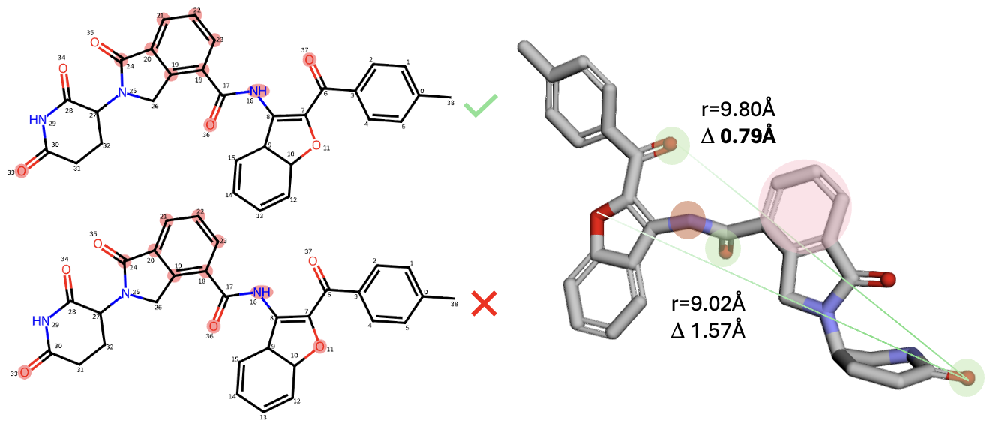
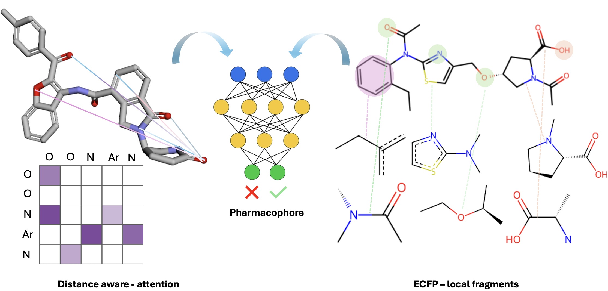

# pharmaco-explainer

## Project overview

This repository introduces a benchmark dataset and evaluation framework
designed to assess pharmacophore explainability in molecular
machine learning models.

<p align="center">
  
</p>

The dataset consists of molecules uniquely matched to a reference pharmacophore using a single, unambiguous atom mapping, ensuring reliable atom-level explainability.

**Post-hoc explainability benchmarking.**  
State-of-the-art models based on fragment fingerprints (ECFP) and distance-aware representations are evaluated to assess whether explanations are consistent with pharmacophore geometry.

<p align="center">
  
</p>

This repository implements a full pipeline for pharmacophore-based dataset construction,
graph and transformer-based molecular modeling, and model explainability.

The project covers:

- geometric pharmacophore alignment,
- pharmacophore-based labeling of large molecular libraries,
- construction of graph-based and MAT/RMAT representations,
- training of machine learning and deep learning models,
- post-hoc explainability through per-atom attribution methods.

The pipeline is designed to run at scale on HPC (SLURM).

## Prerequisites

### Environment variable
To correctly run scripts across this repository we
recommend to set environment variable to main folder of this project
in your disc:

export PHARM_PROJECT_ROOT=/path/to/project

### Environment setup

Two Conda environments are provided:
- `conda_env_x86.yaml` – for x86_64 architectures
- `aarch64.yaml` – for ARM / GH200 nodes

Create environment with:

```bash
conda env create -f conda_env_x86.yaml
conda activate pharmaco-explainer
```

## Data Preparation

### 1. Generating conformers for pharmacophore alignment

For each molecule, a fixed number of conformers is generated to enable robust pharmacophore alignment.

In this pipeline, up to **50 conformations per molecule** are generated and stored in SDF format.  
These conformers are used as the input ensemble for subsequent pharmacophore alignment and screening.

Conformer generation is performed with:

```bash
python src/dataset_preparation/prepare_sdf_for_screening.py \
  --in-parquet path/to/input.parquet \
  --out-dir path/to/output_sdfs \
  --target-confs 50
```

### 2. Pharmacophore alignment and label generation

This step performs **pharmacophore-based alignment** of molecular conformers and assigns labels based on geometric matching.

For each molecule ID, all available conformers are evaluated against a predefined pharmacophore hypothesis.  
Candidate atom assignments (HBA, HBD, aromatic) are enumerated and checked using distance tolerances.

A molecule is labeled as **positive (`y = 1`)** if and only if **exactly one unique pharmacophore configuration** matches across all its conformers.  
Otherwise, the molecule is labeled as **negative (`y = 0`)**.

#### How to run

```bash
python data_preparation/pharmacophore_alignment_pipeline.py \
  --part-dir path/to/sdf_files/part_000 \
  --plots-root path/to/plots \
  --out-root path/to/labels_out \
  --pharm k4 \
  --hypo-json hypothesis/k4.json \
  --cpus 8 \
  --tol-core 1.0 \
  --tol-ar 2.0
```

### 3. (QC): Retrieve positive conformers

- Retrieves **positive conformers** from large SDF files based on pharmacophore alignment results.  
  For each molecule, the conformer selected during labeling (e.g. `winner_conf_id`) is extracted.

- Used for **quality control (QC)** and downstream inspection of conformers that satisfied pharmacophore constraints, without reprocessing full SDF archives.

- The script reads label files for a given pharmacophore mode (`k3`, `k4`, or `k5`) and `part_*`, identifies molecules with `y = 1`, and extracts the corresponding SDF records from the source files into a separate output directory.

- Run on HPC using the provided template:

  ```bash
  sbatch --array=0-52 \
    --export=ALL,K=k4,BASE_DIR=/path/to/project_root \
    scripts/qc_retrieve_positive_conformers.sh
  ```

### 4. Graph generation

- Generates **graph-based representations** of molecules from prepared tabular data for a selected pharmacophore setting (`k3`, `k4`, or `k5`).

- Reads an input parquet file (`ks{K}.parquet`) and converts each molecule into a graph format suitable for downstream graph-based or deep learning models.

- Run on HPC using the provided template:

  ```bash
  sbatch --export=ALL,K=4,BASE_DIR=/path/to/project_root \
    scripts/graph_generation.sh
  ```

### 5. MAT / RMAT featurization

- Generates **MAT or RMAT molecular features** using attention-based transformer models from HuggingMolecules.

- Two featurization modes are supported:
  - `no_pos` – features are generated from a **3D conformer internally constructed from SMILES** (native HuggingMolecules behavior).  
    This mode produces **one feature representation per molecule ID**, independent of pharmacophore alignment.
  - `with_pos` – features are generated from the **exact 3D conformer selected during pharmacophore alignment**.  
    Each generated feature corresponds to a **pharmacophore-matched conformer** and therefore represents a **structural positive by construction** (`y = 1`).

- Featurization is performed **independently of dataset splitting and labeling**.  
  Feature objects are stored together with molecule IDs as `(feature, ID)` tuples and can be **reused across multiple datasets** (`k3`, `k4`, `k5`).

- For large-scale libraries (e.g. millions of molecules), MAT/RMAT featurization is computationally expensive and should be **performed once**, followed by **dataset-specific assignment of labels and splits**.

- Run on HPC using the provided template:

  ```bash
  sbatch --array=0-9 \
    --export=ALL,BASE_DIR=/path/to/project_root,K=4,MODEL_TYPE=mat,MODE=no_pos \
    hpc/featurize_mat_rmat.template.sh
  ```

## Data Preprocessing (optional)

All datasets used in this project are already **fully preprocessed** and publicly available on HuggingFace:

https://huggingface.co/datasets/klimczakjakubdev/pharmaco-explainer

Running data preprocessing is **NOT required** to train models or reproduce the main results.
The preprocessing code is provided for **reproducibility** and for applying the same pipeline
to **custom molecular datasets**.

### Download preprocessed data (recommended)

```bash
python src/download_data.py
```

The preprocessing pipeline converts pharmacophore-labeled molecules into
model-ready tabular datasets by:

* assigning train/test splits,
* computing molecular fingerprints,
* computing Tanimoto similarity to positive samples,
* merging all features into final datasets.

Final outputs are stored under:
data/k{K}/processed/

Pipeline steps (for custom data):

1. Add train/test split

2. Divide dataset into chunks

3. Generate molecular fingerprints

4. Compute Tanimoto similarity

5. Merge final dataset

Each step is implemented in src/data_preprocessing/ and exposed as SLURM-ready scripts
in scripts/data_preprocessing/.

Running preprocessing (HPC)
```
sbatch scripts/data_preprocessing/add_scaffold_split.sh
sbatch scripts/data_preprocessing/generate_ecfp.sh
sbatch scripts/data_preprocessing/compute_tanimoto.sh
sbatch scripts/data_preprocessing/add_distance_split.sh
```

## Run Training

### 1. GCN training

- Trains a **graph convolutional network (GCN)** on precomputed molecular graph representations.

- Uses graph features generated during data preparation and dataset-specific train/validation/test splits (`split_distant_set`, `split_close_set`, or `all`).

- Training is executed per pharmacophore dataset (`k3`, `k4`, `k5`), with checkpoints and results stored separately for each split configuration.

- Run on HPC using the provided template:

  ```bash
  sbatch \
    --export=ALL,K=4,BASE_DIR=/path/to/project_root,SPLIT_TYPE=split_distant_set \
    scripts/train_gcn.sh
  ```

### 2. MAT / RMAT training

- Trains a **Molecule Attention Transformer (MAT)** or **Relational MAT (RMAT)** on precomputed molecular features stored as `(feature, ID)` tuples.

- Feature computation is performed once at scale; labels (`y`) and dataset splits are applied later based on molecule IDs, enabling efficient reuse across `k3`, `k4`, and `k5` datasets.

- Supports standard training as well as runs augmented with precomputed **with_pos** features, where matched conformers are injected for positive samples.

- Run on HPC using the provided template:

  ```bash
  sbatch \
    --export=ALL,BASE_DIR=/path/to/project_root,MODEL=mat,K=k4,DIFFICULTY=normal \
    scripts/train_mat_or_rmat.sh
  ```

### 3. Train Fingerprint-based Models (MLP / RF / XGB)

This section covers training **machine learning models** based on molecular fingerprints (ECFP):

- **MLP** – multi-layer perceptron trained on 2048-bit ECFP features.
- **RF** – random forest classifier.
- **XGB** – XGBoost gradient boosting classifier.

All models support:

- Grid search over hyperparameters (learning rate, number of hidden layers / estimators, dropout, hidden dimensions, etc.).
- Early stopping (MLP: patience 7 epochs) based on **validation ROC-AUC**.
- Class imbalance handling (positive weights for BCE loss in MLP, balanced sampling for RF/XGB).

#### Usage (SLURM / HPC)

```bash
sbatch --export=ALL,K=3,BASE_DIR=/path/to/project_root,SPLIT_TYPE=easy \
scripts/training/models/train.sh
```

## Explainability

### 1. MAT / RMAT

Run per-atom attributions (Vanilla Gradients or Grad-CAM) for MAT/RMAT models on SLURM.

### Script

`compute_mat_rmat_attributions.sh`

### Usage (SLURM)

Set parameters via `sbatch --export`:

```bash
sbatch --export=ALL,\
METHOD=gradcam,\
MODEL=mat,\
CHECKPOINT=checkpoints_mat/mat_k4_normal_with_pos/best_model.pth,\
TEST_PICKLE=pharmaco_explainer/pickle_dataloaders/mat/k4/normal/test/test.p,\
POSITIVE_PICKLE_POS_PATH=pharmaco_explainer/pickle_dataloaders/mat/k4_positive/k4_positive.p,\
OUTPUT_FILE=results_k4/GradCam_mat_all_with_pos.parquet \
compute_mat_rmat_attributions.sh
```

### 2. Explainability for Trained Models

This section describes how to compute **explainability/attribution scores** for both GCN and fingerprint-based models (MLP, RF, XGB) using SHAP or gradient-based methods.

#### 2.1 Fingerprint-based Models (MLP / RF / XGB)

- **MLP**
  - SHAP DeepExplainer for feature-level importance.
  - Vanilla Gradients (optional) for gradient-based attribution.
- **RF / XGB**
  - SHAP TreeExplainer for feature-level importance.

**Workflow:**
1. Load trained model from `results/checkpoints/{dataset}`.
2. Compute fingerprints from SMILES (Morgan/ECFP).
3. Compute SHAP values or gradients per molecule.
4. Aggregate fingerprint-level scores to atoms (bit-to-atom mapping).
5. Compute **fidelity** by masking top-k important bits and measuring prediction drop.
6. Save per-atom explainability and fidelity metrics in `results/shap/{dataset}/`.

**Output files:**
- `{model}_{split}_fidelity.csv` → fidelity, accuracy, masked_accuracy.
- `{model}_{split}_per_atom.parquet` → per-atom attribution values.

#### 2.2 GCN Models

- **Grad-CAM**: identify top-k influential nodes (atoms) in graph convolution layers.
- **Vanilla Gradients**: node-level gradient importance.

**Workflow:**
1. Load trained GCN model from `results/checkpoints_gcn/{dataset}`.
2. Load graph data for the test set.
3. Compute node attributions using Grad-CAM or Vanilla Gradients.
4. Mask top-k important nodes and compute **fidelity**.
5. Save per-atom/node explainability and fidelity metrics in `results/shap/{dataset}/`.

**Notes:**
- Top-k important atoms/nodes are used for masking to assess the impact on predictions (fidelity).
- Results include atom/node index, importance values, and radii (for fingerprints).
- Supports `split` selection (`easy`, `hard`) and different model types (`mlp`, `rf`, `xgb`, `gcn`).

**Example usage:**

```bash
python scripts/explain_models.py --dataset k3 --model mlp --split easy
python scripts/explain_models.py --dataset k3 --model rf --split hard
python scripts/explain_gcn.py --dataset k3 --model gcn --split easy
```